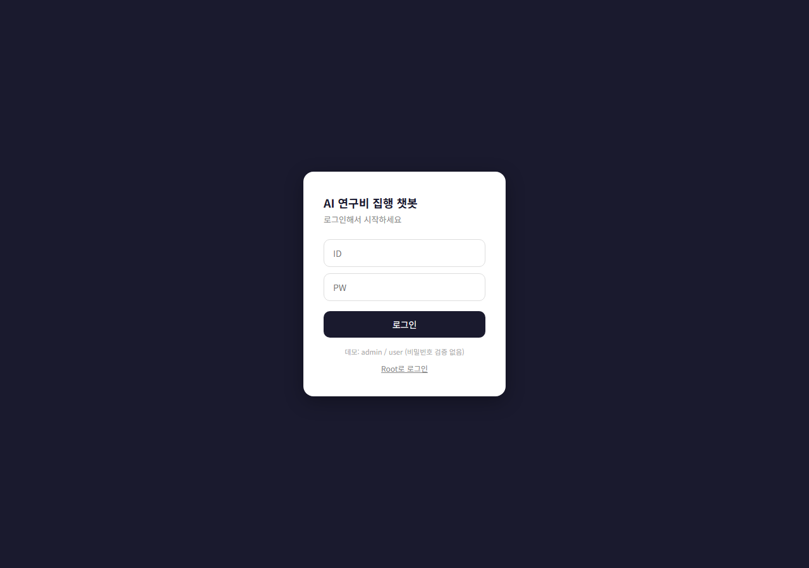
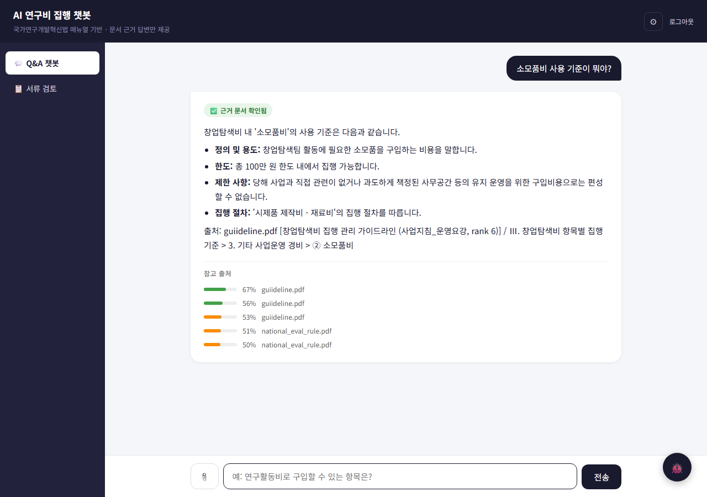
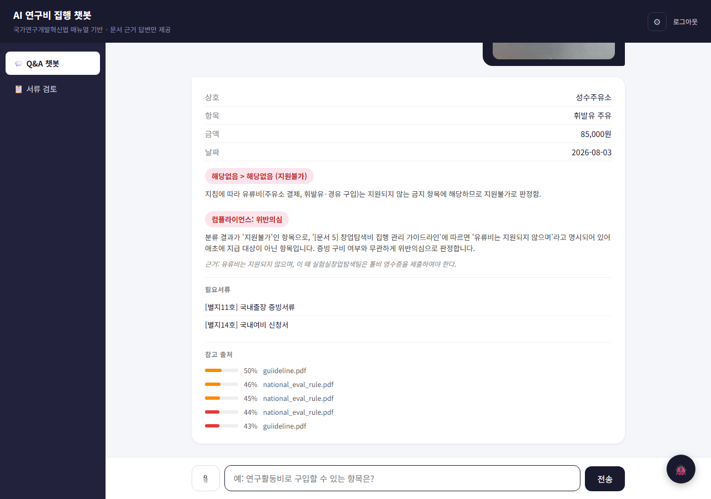
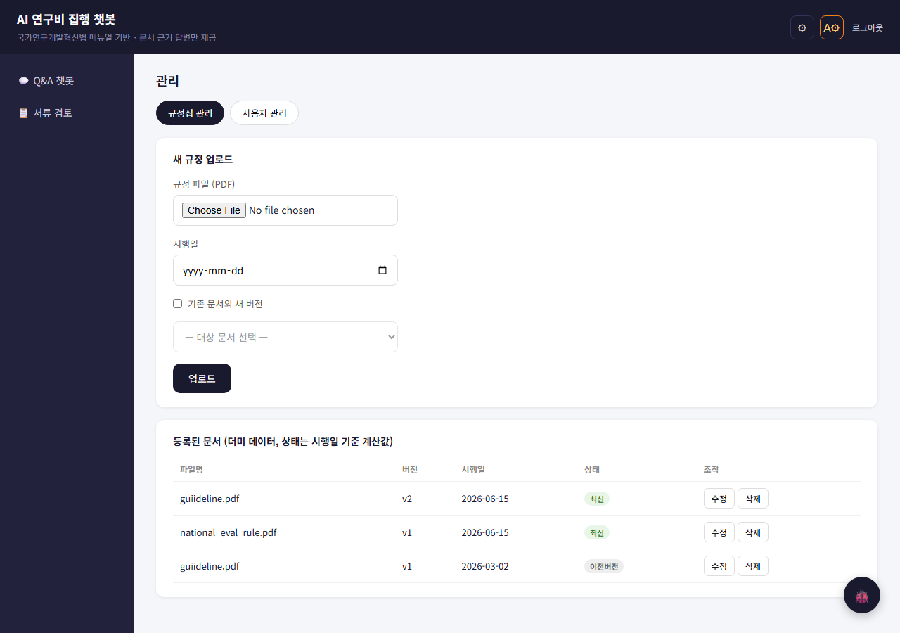

# 사업비 집행 가이드 챗봇

**라이브 데모**: https://rag-expense-guide-bot.onrender.com
(데모 계정: `user` / 비밀번호 검증 없음)
Render 무료 인스턴스라 15분 방치 시 절전되며, 첫 요청에 50초 정도 걸린다.

---

## 1. 뭘 하는가

국가연구비(창업탐색비) 집행 규정 RAG 챗봇 + 정산 서류 검토 시스템이다.
학생이 규정을 자연어로 묻고 답을 받고, 정산 서류(영수증)를 올리면 집행 규정에 맞는지 컴플라이언스 검사를 받는다.
관리자가 규정 PDF를 넣으면 자동으로 청킹·임베딩돼 검색 가능한 지식베이스가 된다.

### 화면

| | |
|---|---|
|  |  |
| 로그인 화면 | 챗봇 — 질문에 근거 문서·출처와 함께 답한다 |
|  |  |
| 챗봇에 영수증을 첨부하면 비목 판정과 컴플라이언스 검토를 받는다. 인용된 조항이 실제 근거인지 확인할 수 있다 | 관리 탭 — 규정집 버전 관리 |

---

## 2. 목표 워크플로우

```
[관리자]  규정 PDF 업로드 → 변환 → 청킹 → 임베딩 → Qdrant        ⚠ 동작하나 미측정
                                                ↓
[사용자]  ① 질문 → 검색 → 답변                                    /chat
              └ 검색(retrieval)                                 ✅ 측정됨 (hit@1 65%)
              └ 답변 생성                                        ⚠ 동작하나 미측정

          ② 정산 서류 제출 → 서류 검토
              └ 첨부 영수증 판정                                  /classify-receipt   ✅ 측정됨
              └ 항목이 맞는 자리에 들어갔나                        (미착수)            ⏳ 미착수
              └ 비율 캡 검사                                      /review-settlement  ⚠ 동작하나 미측정
```

**미착수/미지원**:
- HWP 지원 없음 — PDF만 변환 가능
- 관리자/사용자 인증 없음
- "항목이 맞는 자리에 들어갔나"(정산서류 내 비목 배치 검증) 미착수
- `/review-settlement`는 API만 존재 — 프런트(`static/index.html`)에 탭 없음

**영수증 판정(`/classify-receipt`)이 서류 검토(`/review-settlement`)의 부품이다.** `/review-settlement`는 여러 영수증에 `classify_receipt()`를 그대로 재사용해 개별 판정을 모으고 비율 캡을 검사하는 구조라, 이번 작업 대부분이 영수증 판정 쪽부터 파고든 이유가 여기 있다 — 부품이 안 맞으면 조립체를 재도 의미가 없다.

---

## 3. 측정 결과

| 지표 | 값 |
|---|---|
| 영수증 flag macro recall | **100%** (3회, 31장) |
| citation 정답 조항 인용 | **9/9** (수정 전 0/18) |
| status (compliance) | **97~100%** (다수결 베이스라인 90%) |
| `is_receipt` negative recall | **100%** (37장, 3회) |
| `is_receipt` 오탐(실영수증 거절) | **0/93** |
| chat retrieval hit@1 | **65%** (colloquial 60% / formal 70%), MRR 0.758 |

**측정 방법**: 3회 반복해 최솟값 기준으로만 채택/롤백 판정한다(1회 측정으로 판단 안 함). 다수결 베이스라인을 항상 병기하고, 단일 클래스 수렴 검사(출력 종류가 1개면 정확도가 높아도 성능이 아님)를 제일 먼저 본다. `/search`(chat retrieval)는 임베딩+코사인 검색만 타는 결정론적 경로라 1회 측정으로 충분함을 실측 확인함(3회 jsonl 정렬 후 diff 0바이트).

상세 원인 규명 과정은 로컬 문서(`document/`, 커밋 안 됨)에 있다.

---

## 4. 어떻게 여기까지 왔나

**(1) flag 정확도 0% → 100%.** 네 번 수정하고 각각 1회씩 측정해 개선/악화를 판정했는데, 코드를 한 글자도 안 바꾸고 3번 돌리니 macro recall이 48~82%로 흔들렸다 — 분산 34%p. 네 번의 판정 전부가 노이즈였다. 원인은 LLM의 비결정성이 아니라 판단 근거의 부재였다. 분류 단계가 참조하는 taxonomy에 금지 조항을 "영수증에 인쇄된 사실만으로 판정 가능한가"로 갈라 넣자 정확도와 재현성이 동시에 해결됐다(분산 0%p).

**(2) citation 정답 조항 인용 0/18 → 9/9.** flag 정확도는 이미 100%였는데, 그 판정의 근거(citation)를 열어보니 18건 전부 무관한 조항("불인정 기준 공통사항")을 인용하고 있었다. 분류 단계가 taxonomy만으로 이미 정답을 냈고, 컴플라이언스 단계는 근거 없이 동의만 하고 있었던 것 — 결론은 맞고 근거는 틀린 상태. 지원불가 분기의 고정 검색 쿼리를 회의비 1개 → 금지조항 커버 2개로 교체해 해결했다.

**(3) chat retrieval hit@1 55% → 65%.** 간판 기능(`/chat`)을 두 달 넘게 질문 1개, 1회 측정으로 재고 있었다는 걸 뒤늦게 발견했다. 24문항 라벨(`eval/labels_chat.csv`)을 새로 만들어 재니 구어체 질문은 40%밖에 안 됐다. "노트북 사도 되나요?"라는 질문은, 정답 청크에 "노트북"이라는 단어가 리터럴로 박혀 있는데도 검색 순위 115위로 밀렸다 — 세목 3개(기자재구입비/기자재임차비/지식재산권창출활동비)가 청크 하나에 묶여서 신호가 희석된 것. h3(세목) 경계에서 강제로 분리하도록 청킹을 고쳐 구어체 40% → 60%, 전체 55% → 65%로 개선했다.

**(4) 두 번의 오진.** 진단 중 bash curl로 한국어 쿼리를 보냈는데 Windows 인코딩 문제로 서버엔 깨진 문자열이 도달했고, 그 결과를 "인덱싱 자체가 문제"라고 잘못 짚었다 — Python `requests`로 바꾸니 정상이었다. 또 청크 병합의 원인을 `MIN_CHUNK_SIZE=300`으로 보고 100으로 낮춰 재임베딩했는데, 청크 수·길이가 완전히 그대로였다(no-op) — 패킹 조건이 OR라 `MAX_CHUNK_SIZE` 쪽이 실질 결정권을 쥐고 있었다. **도구부터 의심할 것, 상수 이름이 아니라 조건문을 읽을 것.**

---

## 5. 변환 검증

원본 PDF와 변환 마크다운을 대조하는 도구를 만들어 확인했다
(`eval/validate_conversion.py`, pypdf 기반, LLM 호출 없음).

글자수만 비교하면 마크다운이 원문의 절반 수준이라 처음엔 변환 손실로 봤다.
핵심 용어 12개를 대조하니 대부분 78~100%였고, 낮게 나온 두 개
(시제품 26/46, 지식재산권 9/20)를 실제로 추적한 결과 결측 31건이
전부 [Ⅴ. 관련서식] 별지 양식 페이지에서 나왔다.

변환 프롬프트가 복잡한 서식 레이아웃을 `[Image: ...]`로 처리하도록 설계돼 있어,
별지 양식의 작성요령·각주·빈칸 라벨은 텍스트로 남지 않는다.
판정에 실제로 쓰이는 조항(Ⅲ장 집행기준, 참고1·참고2 표)은 두 키워드 모두
100% 보존됐다.

→ 글자수 비율은 손실률이 아니다. 페이지 번호·머리말·표 구분자 등
   구조 노이즈가 제거된 결과이며, 무엇이 빠졌는지 세어보기 전에는 판단할 수 없다.
   (글자수 비율 자체는 pypdf 버전에 따라 달라져 재현 가능한 지표가 아니다.
    키워드 카운트는 버전 간 일치했다.)

재현: `python eval/validate_conversion.py manual/guiideline.pdf <키워드...>`

---

## 6. 알려진 한계

- 영수증 평가셋 31장, `지원불가` 정답 3건 — 1건이 33%p. 금지 목록에 유류비·주차비를 명시했는데 정답 3건이 정확히 그것이라 leakage에 가깝다.
- 렌터카·범용기자재·귀금속 조항은 검증 0건(해당 영수증이 평가셋에 없음)
- `/chat` 답변 품질 미측정 — retrieval만 쟀다
- score로 no_answer(정답 없는 질문)를 못 가른다 — no_answer 평균 0.447 vs answerable 평균 0.453, 거의 안 갈림
- `/review-settlement` 미측정, UI 미노출
- `absolute_cap`(절대금액 캡) 구조적 미작동 — 코드는 있으나 소비하는 곳이 없음

---

## 7. 스택 / 실행법

`FastAPI` · `Qdrant` · `Gemini`(PDF 변환 + LLM) · `jina-embeddings-v3`(1024-dim) · `Docker Compose`

초기 프로토타입은 n8n 오케스트레이션 구조였으나(`backup/`에 이력만 남음), 현재는 FastAPI 단일 서비스로 통합돼 있다.

**Windows(원클릭)**: `run_demo.bat` 더블클릭 — Docker Desktop이 꺼져있으면 자동 기동, 컨테이너 기동 → 헬스체크 대기 → 브라우저 자동 오픈까지 처리한다. 끌 때는 `stop_demo.bat`(컨테이너+Docker Desktop+WSL까지 정지, 관리자 권한 필요).

**수동**:
```bash
docker compose up -d
# GET /health 로 준비 상태 확인 후 http://localhost:5000 접속
```

### 배포

Render 무료 티어 단일 컨테이너. Qdrant를 별도 서버가 아니라 qdrant-client 로컬 모드(파일 기반)로 띄우고, 인덱스(466포인트, 20MB)를 이미지에 포함해 컨테이너 하나로 동작한다.

배포 전 검토한 것:
- 무료 티어 비교: Fly.io는 무료 티어 폐지, Railway는 크레딧 소진 후 유료 → Render 선택
- Qdrant Cloud 무료 티어는 1주 방치 시 suspend되어 데모 링크로 부적합 → 로컬 모드 채택
- 이미지 1.25GB → 784MB(multi-stage로 build-essential 제거) → 795MB(인덱스 포함)
- 런타임 메모리 125MB로 512MB 제한 내
- Dockerfile이 app.py만 COPY하고 나머지는 compose 바인드마운트에 의존해 이미지 단독으로는 ImportError로 죽는 상태였음 — 배포 시도 중 발견해 수정

이미지 빌드 전 인덱스가 필요하다:
```bash
python scripts/migrate_to_local_qdrant.py
```
